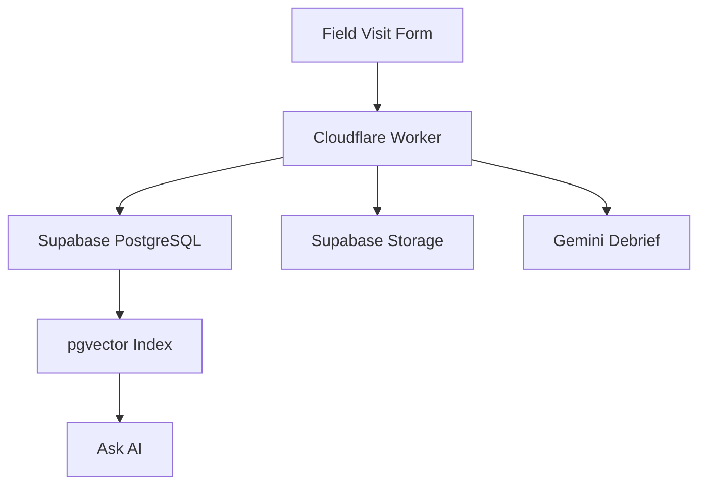
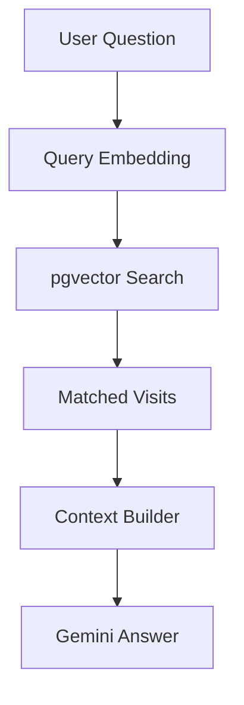

# FieldSense

FieldSense is an open-source field visit intelligence tool for teams that collect field notes, generate AI debriefs, preserve visit records, and ask source-grounded questions across past visits.

It is designed for field teams, NGOs, program managers, and public-interest organizations that often lose important ground-level context across notebooks, spreadsheets, photos, voice notes, and chat threads.

Live demo: https://fieldsense.field-sense-demo.workers.dev

## Why FieldSense

Field visits create useful knowledge, but that knowledge is often hard to retrieve later. FieldSense turns each visit into a structured record with notes, findings, blockers, follow-up actions, media, and AI-generated summaries. Saved visits can then be indexed and queried through RAG, so teams can ask questions such as:

```text
Which visits mention attendance drop, travel cost, or stipend delays?
```

The answer is grounded in saved visit records and points back to the supporting visits.

## Features

- Supabase Auth login with role-based access.
- Field visit creation with location, date, program area, stakeholders, notes, and media.
- AI debrief generation using Gemini.
- Supabase PostgreSQL persistence for visit records.
- Supabase Storage support for photos, videos, and voice memos.
- RAG-based Ask AI panel over indexed visit records.
- Gemini embeddings with Supabase `pgvector` semantic search.
- Admin-only reindexing for refreshing vector search.
- Dashboard insights for recurring blockers, sentiment, and follow-up actions.

## Tech Stack

| Layer | Technology |
| --- | --- |
| Frontend | HTML, CSS, JavaScript served through Cloudflare Worker |
| Backend | Cloudflare Workers |
| Database | Supabase PostgreSQL |
| Authentication | Supabase Auth |
| Storage | Supabase Storage |
| AI Model | Gemini 2.5 Flash |
| Embeddings | Gemini Embedding 2 |
| Vector Search | Supabase `pgvector` |
| Deployment | Cloudflare Workers |

## Architecture



## RAG Flow



## API Routes

| Method | Route | Purpose |
| --- | --- | --- |
| `GET` | `/api/health` | Check deployment, Supabase, auth, AI, and embeddings status |
| `POST` | `/api/auth/login` | Sign in with Supabase Auth |
| `POST` | `/api/auth/logout` | End the current session |
| `GET` | `/api/auth/me` | Get current user and role |
| `GET` | `/api/visits` | List saved field visits |
| `POST` | `/api/visits` | Create a field visit |
| `PUT` | `/api/visits/:id` | Update a field visit |
| `POST` | `/api/visits/:id/media` | Upload visit media |
| `POST` | `/api/debrief` | Generate an AI debrief |
| `POST` | `/api/rag/reindex` | Rebuild vector index for visits |
| `POST` | `/api/rag/query` | Ask AI questions over indexed visits |

## Roles

| Role | Access |
| --- | --- |
| `field_staff` | Create visits, generate debriefs, upload media, view visit history |
| `manager` | View dashboard, visit history, and Ask AI |
| `admin` | Full access, including delete and RAG reindex |

## Setup

Clone the repository:

```sh
git clone https://github.com/amritanshu009/fieldsense-ai-debrief-tool.git
cd fieldsense-ai-debrief-tool
```

Install dependencies:

```sh
npm install
```

Create an environment file:

```sh
cp .env.example .env
```

Set the required values in `.env` or Cloudflare Worker secrets:

```sh
SUPABASE_URL=
SUPABASE_ANON_KEY=
SUPABASE_SERVICE_ROLE_KEY=
SUPABASE_STORAGE_BUCKET=visit-media
ADMIN_EMAILS=
GEMINI_API_KEY=
GEMINI_MODEL=gemini-2.5-flash
GEMINI_EMBEDDING_MODEL=gemini-embedding-2
```

Run the Supabase schema:

```text
schema.sql
```

The schema creates visit tables, media metadata tables, user roles, `pgvector` embeddings, RLS policies, the storage bucket setup, and the vector match function.

## Local Preview

```sh
npm run build
PORT=5174 npm run preview
```

Then open:

```text
http://localhost:5174
```

## Deploy

```sh
npm run build
npx wrangler deploy
```

## Health Check

```sh
curl https://fieldsense.field-sense-demo.workers.dev/api/health
```

Expected result:

```json
{
  "ok": true,
  "storage": "supabase-postgresql",
  "auth": "supabase-auth",
  "ai": "gemini",
  "embeddings": {
    "provider": "gemini",
    "model": "gemini-embedding-2"
  }
}
```

## Demo RAG Question

```text
Which visit mentions students, Excel, online job applications, laptop access, or practice time?
```

The answer should retrieve the matching digital literacy visit and mention the supporting visit context.

## Security

Do not commit `.env`, API keys, Supabase service-role keys, or production credentials. If a real key was ever pushed to GitHub, revoke and rotate it before continuing development.

## Contributing

Contributions are welcome. Good first areas include docs, setup improvements, UI accessibility, sample data, deployment guides, and field-workflow improvements. See [CONTRIBUTING.md](CONTRIBUTING.md).

## Roadmap

See [ROADMAP.md](ROADMAP.md).

## License

MIT License. See [LICENSE](LICENSE).
